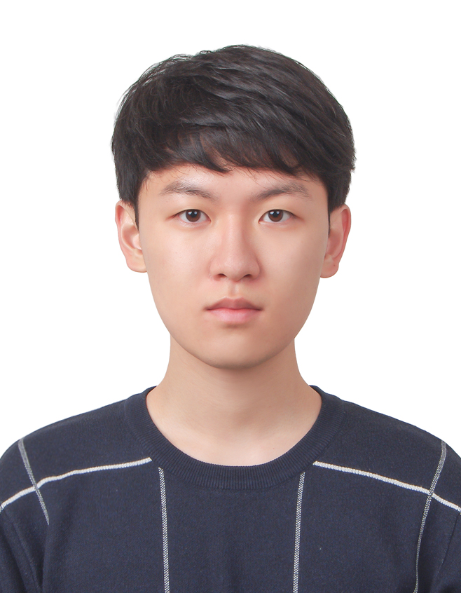

# dku-ce-oss-my-resume
단국대학교 25-2학기 컴퓨터공학과 오픈소스sw개발 과목에 대한 중간 과제입니다. Markdown 언어 활용을 목표로 하여 2025-11-13 기준으로 이력서를 작성합니다.

---
 

# 즐거운 경험을 전하고자 하는 게임 개발자 박세웅입니다.
 

## **Personal Information**

<table style="width:100%; border:none;">
  <tr>
    <td style="width:10%; vertical-align:top; border:none; padding-right:20px;">
      
    </td>
    <td style="width:90%; vertical-align:top; border:none;">
      <table>
        <tr>
          <td>이름</td>
          <td>박세웅</td>
        </tr>
        <tr>
          <td>나이</td>
          <td>23</td>
        </tr>
        <tr>
          <td>전공</td>
          <td>컴퓨터공학과</td>
        </tr>
        <tr>
          <td>Email</td>
          <td>swparkjjang@gmail.com</td>
        </tr>
        <tr>
          <td>Github</td>
          <td><a href="https://github.com/sewoong02">sewoong02 (Park Sewoong)</a></td>
        </tr>
      </table>
    </td>
  </tr>
</table>

## Introduce

안녕하세요!
저는 게임을 통해 즐거움을 느끼는 게이머이자, 이제 막 게임 개발자의 길에 입문한 프로그래머입니다. 
 제가 느낀 즐거움을 다른 사람들에게 나누어 행복하게 해주는 게임 개발자가 되고 싶습니다.

  저의 강점은 **적극적인 소통**과 **꼼꼼함**이라고 생각합니다.

### 적극적인 소통

- 목표를 위해 적극적으로 의견을 제시합니다.
- 팀원의 의견을 경청하고 존중하여 더 나은 결과물을 만들기 위해 노력합니다.
- 배려와 도움을 통해 긍정적인 시너지를 만들어 낼 수 있다고 생각하여 이를 실천합니다.

### 꼼꼼함

- 놓치기 쉬운 부분이나 케이스를 파악하여 결과물의 완성도나 안정성을 높이는 것을 선호합니다.
- 목표를 달성하기 위해 전체 구조와 리스크를 분석하여 문제를 인지하고 대처하려고 합니다.
- 보기 쉽고 꼼꼼하게 작성된 코드를 짜려고 노력합니다.

### 목표

- 팀의 윤활유 역할을 수행하며 동료의 어려움을 좌시하지 않고 저의 일처럼 도와서 긍정적인 시너지를 만들고 싶습니다.
- 주어진 일에 책임감 있게 해내는 그런 게임 개발자가 되고 싶습니다.

## **Tech stack**

Unity, C, C#, C++, Notion, Figma, Github

## Project

### Dodge 게임 (2025년 2월 말 - 3월 초) [Github](https://github.com/sewoong02/dodge)

유니티 입문을 목적으로 골드메탈의 2d 뱀서류 게임 에셋을 활용하여 제작한 간단한 탄막 피하기 게임입니다.

사용 기술: Unity 3D, c# 

역할 및 성과:

- 게임 프로그래밍 기초 및 Unity 기반 실습
    - Unity의 사용법과 엔진에 대한 기본 개념(생명주기 등)을 익히고 C#의 기본 문법을 공부함
    - Prefab, Scenes, new Input System, 물리에 대해 배움
 

### **자원 채굴 게임 (2025년 9월  - 현재) [Github](https://github.com/SeungwonChoi-kr/Radiant_Relics)**

간단한 스토리 기반의 어드벤처 게임으로 자원을 수집하고 모은 자원을 통해 엔딩으로 나아가는 게임입니다.

사용 기술: Unity 3D, c# 

역할 및 성과:

- 게임 핵심 로직 및 UI 구현:
    - 자원 탐지, 생성, 채굴 및 도구 스왑 시스템을 구현
    - 도구 교체 및 도구 오브젝트 직접 제작함
    - **Directional Light**을 이용하여 밤과 낮 구현을 할 예정
- 전체적인 로직 설계 및 통합:
    - NPC, 인벤토리 시스템 등의 전체적인 시스템 구조를 설계
    - 팀원들이 작성한 로직 스크립트의 통합을 담당

## Education & **Experiences**

| 구분 | 기간 | 주요 내용 |
| --- | --- | --- |
| 단국대학교 컴퓨터공학과 재학 | 2021년 3월 - 2027년 2월(예정) | 재학중, 전공학점 3.74 |
| 개발/보안 중앙동아리 Aegis 운영진 | 2024년 12월 - 현재 | **- 테크톡 2회 참여** : Unity의 최적화 기법인 **오브젝트 풀링**과 **코루틴**에 대해서 발표 **- Mini Project 경연대회 기획 및 진행** : 개발에 익숙치않은 저학년 학부생을 위해 학교 선배님들의 멘토링과 함께 사이드 프로젝트를 만드는 프로그램을 기획 및 진행중 (2025년 2학기 동아리 인원의 10%에 해당하는 7명이 참여함)  **- 해커톤(Easython) 개최 :** 초보 개발자들을 위한 해커톤으로 SW중심대학사업단의 후원을 받아 진행중 - 매 학기 C언어를 가르치는 **스터디**를 열어 1학년과 복학생 후배들에게 도움이 되고자 함 |
| Aegis 코드클럽 관리자 | 2025년 3월 - 현재 | 대지중학교 관계자분과 협의하여 학생들에게 총 7주간 진행하는 **코딩 봉사활동**을 매 학기 진행 |
| 컴투스 멘토링 스쿨 | 2025년 11월 20일 - 11월 21일(예정) | 다음 주에 **게임 클라이언트 개발**과 **게임 기획**에 대한 세션에 참여하여 현업자분들과 멘토링을 진행할 예정입니다. |
